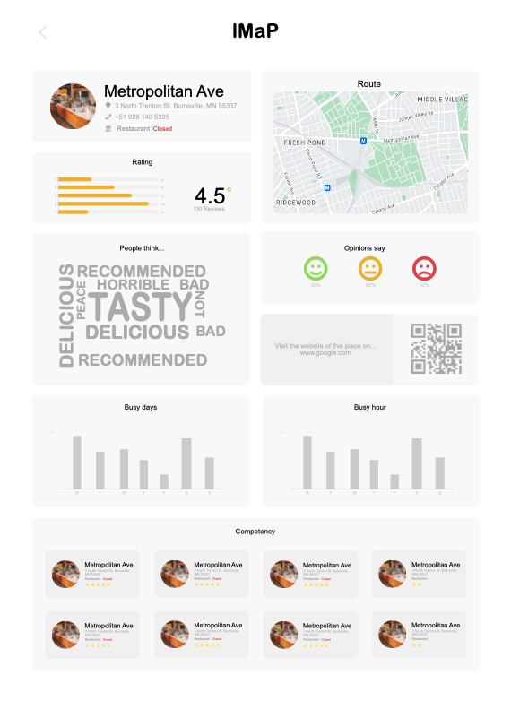

# location-parser
Location Parser is a comprehensive system designed to extract and analyze location-based data. The system includes an API that retrieves information about a specific location or multiple locations at once, as well as an extractor that collects information visible only to Google Maps users.

Location Parser uses advanced data processing techniques to analyze location-based data and present it in a user-friendly dashboard built using Streamlit and React. The dashboard provides an intuitive view of the data, allowing users to easily filter and visualize data based on their specific needs.

One of the unique features of Location Parser is its ability to generate reports based on the analyzed data, which can be downloaded for further analysis and sharing. This feature has been a particular challenge, and the development team is proud to have successfully implemented it.

With Location Parser, you can extract and analyze location-based data with ease, gain insights into user behavior, identify emerging trends, and make data-driven decisions. Whether you're monitoring store locations, analyzing foot traffic patterns, or exploring new markets, Location Parser provides a powerful tool to help you stay ahead of the curve.
